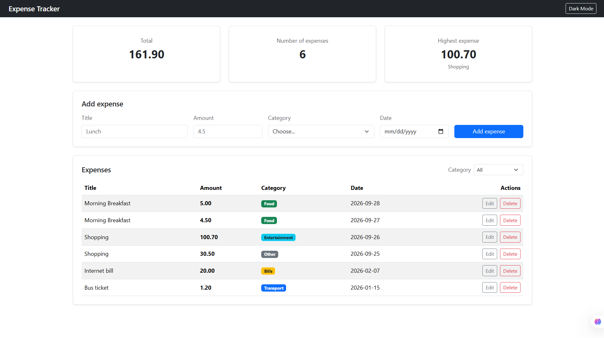
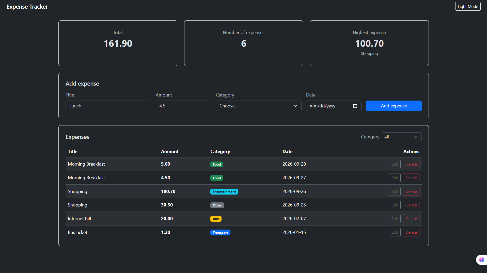
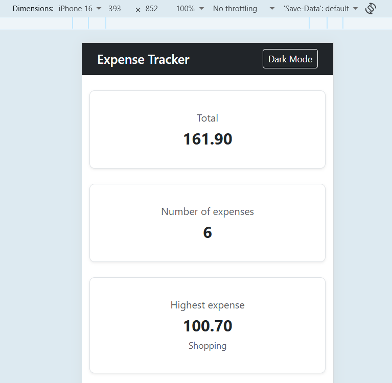
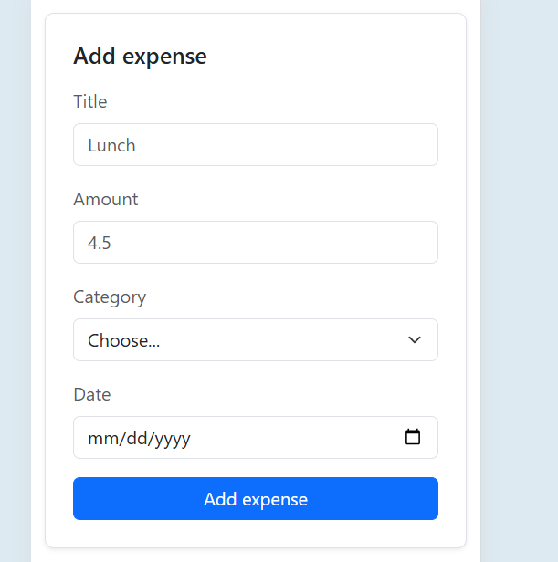
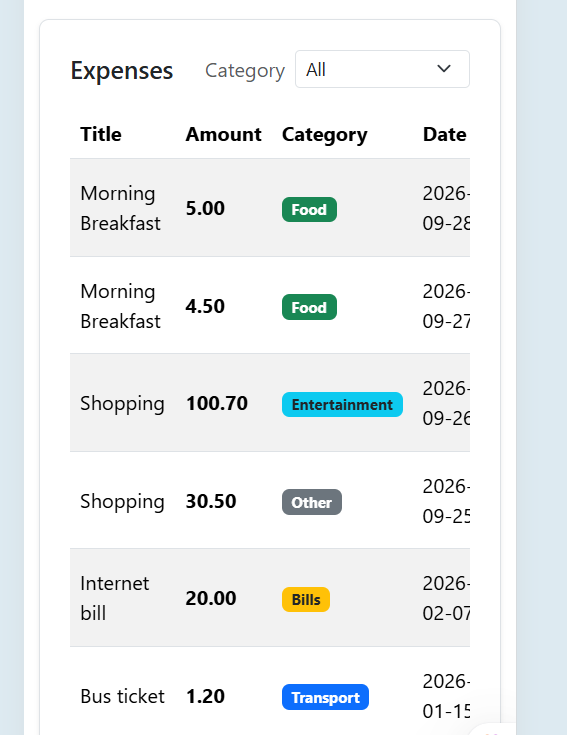

# Expense Tracker

A full-stack, responsive web application that helps users manage their personal finances. It allows users to easily add, edit, delete, and categorize their daily expenses, with real-time summary statistics and data securely persisted in a PostgreSQL database.

## How to run

**Backend**

1. Open your terminal and navigate to the project directory.

2. Run npm install to install all required dependencies (since node_modules are excluded).

3. Open PostgreSQL (via pgAdmin or terminal) and create a new database (e.g., expense_tracker).

3. Locate the schema.sql file in the project folder and execute its contents inside your new database to create the required expenses table.

4. Find the file named .env.example, rename it to .env, and update the variables inside it with your actual PostgreSQL credentials (DB_USER, DB_PASSWORD, DB_NAME, etc.).

5. Start the API server by running node server.js (or npm start). The server should start running on http://localhost:3000.

**Frontend**

1. The frontend is built with vanilla HTML, CSS (Bootstrap), and JavaScript, so no package installation is needed.

2. Simply open the index.html file in your preferred web browser.

3. Recommended: For the best experience, open the project in VS Code and use the "Live Server" extension to serve the index.html file.

## Features

- [✅] Add an expense (with validation)
- [✅] Delete an expense
- [✅] Edit an expense
- [✅] Filter by category
- [✅] Summary cards (total, count, highest)
- [✅] Data is saved in a PostgreSQL database
- [✅] Bonus: Dark/Light mode theme toggle using local storage

## Screenshots

*Desktop view showing the main dashboard and expense table.*

*Mobile view showcasing the responsive design and add expense form.*

## What was the hardest part?

The most challenging part of the project was cleanly managing the asynchronous flow between the frontend UI and the backend PostgreSQL database, especially when editing an expense. I had to ensure that the correct id was passed to the Bootstrap Modal, sent properly via a PUT request, and that the UI only updated after receiving a successful response from the database.
I solved this by adopting a layered architecture in my app.js (separating API logic, UI rendering, and event listeners) and using modern async/await syntax with global state caching. This made the code predictable, easy to debug, and allowed for lightning-fast local filtering without overloading the backend with redundant requests.

## GitHub repository URL
https://github.com/Mamoun-developer/expense-tracker-starter.git

## Drive URL
https://drive.google.com/file/d/1KtdXgHScSr8koVYSKzatFuuvGLKdcKiq/view?usp=sharing

